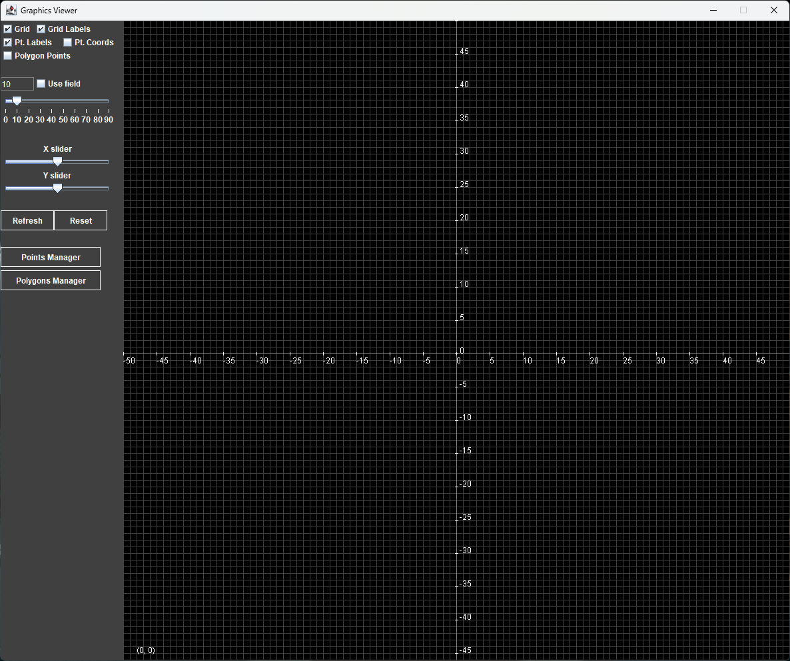

# Graphics Viewer

This is a 2D graphics editor and viewer written in Java 17. It features a multi-window GUI with a main window containing a viewport and a sidebar with tools and settings. The app supports points, lines and polygons.

It was developed as a coursework for a Computer Graphics course in ETU.

## Try It Out
First, make sure you have JDK 17 or later installed. Then follow these steps:
1. Clone this repository and enter this folder.
2. Run `gradle build` to compile classes (like `./gradlew build`).
3. Run `gradle jar` to build executable (like `./gradlew jar`).
4. Run `java -jar .\build\libs\glab_one-1.0-SNAPSHOT.jar` to launch the app.

## Screenshot

